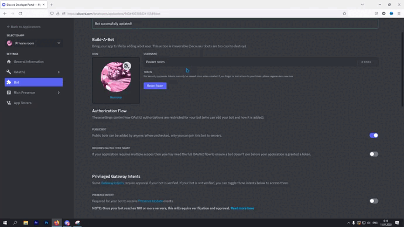

# PrivateRoomnewButtonDiscord

## Установка

- [Node](https://nodejs.org/en/)
- [NPM](https://www.npmjs.com/)
- [MONGO](https://account.mongodb.com/account/login)

## Этап 1

Для того, чтобы запустить бота нам нужно!

### Установка

- [Туториал](https://youtu.be/1IfuyBbY9PE)
- [Поддержка](https://discord.gg/YJXwRqrbMV) & Мурчик#9029

```bash
# Скачиваем исходный код на свой компьютер
git clone https://github.com/Myrchuk21/PrivateRoomnewButtonDiscord

# Переходим в папку
cd PrivateRoomnewButtonDiscord/

# Устанавливаем модули
npm install
```

## Этап 2

**Не забудьте токен:** После создания бота, влючите функцию `applications.commands` далее включите `OAuth2` [перейти на developer portal](https://discord.com/developers/applications/)




## Соц.сети
<a href="https://vk.com/myrchuk21" target="_blank"></a>
<a href="https://www.instagram.com/myr_kuch21/" target="_blank"></a>
